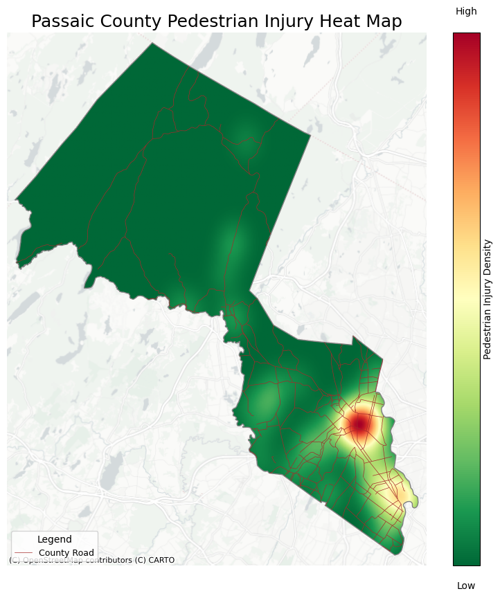

## Passaic County Pedestrian Crash Information Website
Passaic County is a midsized county located in Northern New Jersey, This website provides an overview of where pedestrians have been seriously injured or killed along Passaic County managed roadways. This is an especially important topic as according to the 2025 Passaic County Local Safety Action Plan, more pedestrians are killed and injured on county roadways than on state or municipal roadways. 

This website provides 4 maps that give readers an overview of pedestrian crashes in Passaic County:
1) The first map provides an overview of municipalities in Passaic County.    
2) The second map provides an overview of population density in Passaic County and consequently where pedestrians could be most concentrated. 
3) The third map provides a heat map of where pedestrians have been injured along Passaic County roads and consequently the most dangerous areas for pedestrians.  
4) The fourth map provides specific locations of all locations on County Roads where pedestrians have been killed or seriously injured with pop up information. Additionally, data regarding overburdened communities (as definied by New Jersery Department of Enviromental Protection) is shown as well.  

Map 1: Municipality Overview

This map shows an overview of the municipalities in Passaic County. The county is made up of 16 municipalities that vary widely in size. West Milford at the top is the largest municipality in Passaic County with a size of 81.06 square miles. In contrast, Prospect Park is the smallest municipality in the county and is only 0.47 square miles in size. 

Map 2: Population Density

This map provides an overview of the population density in Passaic County at the tract level using data from the 2019 American Community Survey. From this map it is shown that the southeastern section of this county consists of the urban municipalities of Paterson, Clifton, and Passaic. Adjacent to these municipalities are more suburban areas such as Wayne, Hawthorne, and Woodland Park. Finally, the northern parts of Passaic County such as West Milford and Ringwood are very rural and sparsely populated. 

Map 3: Heat Map

The Map provides a heat map of pedestrian serious injury crashes in Passaic County. It is clear from this map that pedestrian serious injury crashes are concentrated in the municipalities of Paterson and Passaic. 

## Interactive Crash Map
<iframe src="CrashMap2.html" height="540" width="420"></iframe>
You can explore the map [as its own web page here](CrashMap2.html).

## Data Source Descriptions
1) Passaic County Roadway Data
    - This dataset was sourced from the Passaic County Planning Department. 
    - This was prepared by Boyang Wang, the GIS Specialist at Passaic County.
    - It was last updated June 4th, 2025.
    - It was originally a feature layer hosted on the Passaic County GIS portal. So I initially loaded it into ArcGIS Pro and then exported it to a GeoJSON, in order to load the data into colab. 
    - I did not have any issue with data quality that I had to address. 
2) American Community Survey
    - This data is from the US Census.
    - This is from the 2019 ACS so that is when it was last updated
    - I got this data from API access from the US Census. I then had to filter the data to only be at the tract level for Passaic County. Additionally, since the census data was just the population tract level, I had to divide the census population data by the area of each tract in order to calculate the population density.
    - I did not have any issues with data quality. 
3) Pedestrian Serious Injury Crash Data
    - This data is from the North Jersey transportation Planning Authority. 
    - This dataset was last updated April 8th, 2025.
    - I orginally downloaded this data as a GeoJSON. In order to create my heat map and interactive map I had to clip the data to Passaic County.
    - I did not have issues with data quality.
4) Pedestrian Fatal Crash
    - This data is from the North Jersey transportation Planning Authority. 
    - This dataset was last updated April 8th, 2025.
    - I orginally downloaded this data as a GeoJSON. In order to create my heat map and interactive map I had to clip the data to Passaic County.
    - I did not have issues with data quality.
5) Overburdened Community Data
    - This data is from the New Jersey Department of Enviromental Justice.  
    - It was prepared by the NJDEP and was last updated November 24th, 2025.
    - I orginally downloaded this data as a GeoJSON. In order to create my maps I had to clip the data to Passaic County. Also since this data was also at the tract level so I dissolved it to be one big polygon. Finally, I used the diffrence funciton to create another layer that consisted of locations that are not an enviromental justice area.
    - I did not have issues with data quality.

