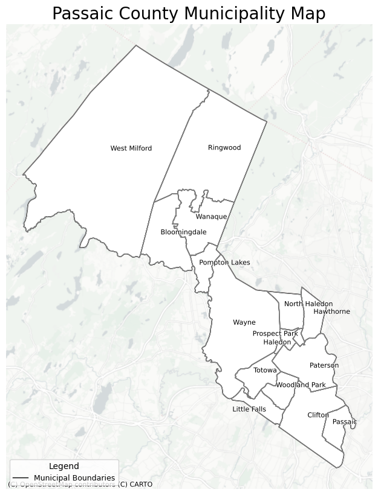
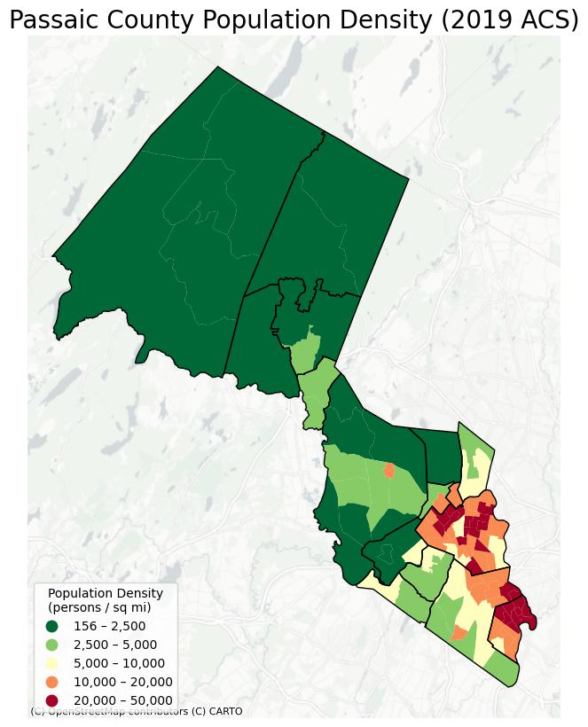
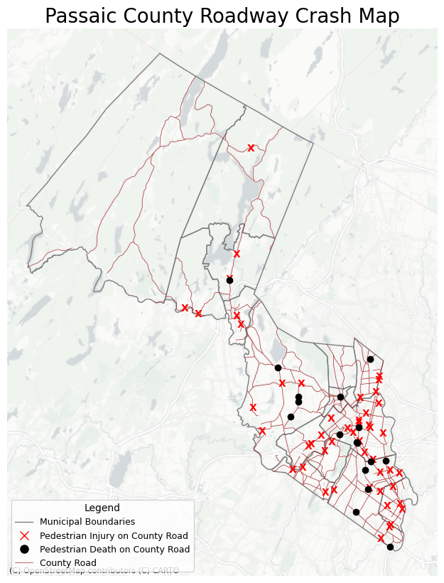

## Passaic County Crash Information

Map 1: Municipality Overview

This map shows an overview of the municipalities in Passaic County. The county is made up of 16 municipalities that vary widely in size. West Milford at the top is the largest municipality in Passaic County with a size of 81.06 square miles. In contrast, Prospect Park is the smallest municipality in the county and is only 0.47 square miles in size. 

Map 2: Population Density

This map provides an overview of the population density in Passaic County at the tract level using data from the 2019 American Community Survey. From this map it is shown that the southeastern section of this county consists of the urban municipalities of Paterson, Clifton, and Passaic. Adjacent to these municipalities are more suburban areas such as Wayne, Hawthorne, and Woodland Park. Finally, the northern parts of Passaic County such as West Milford and Ringwood are very rural and sparsely populated. 

Map 3: Crash Locations

This map provides an overview of all pedestrain crash injury locations that took place on county roads and of all pedestrian crash death locations that happened along county roads.

## Data Source Descriptions
1) Passaic County Roadway Data
    - This dataset was sourced from the Passaic County Planning Department. 
    - This was prepared by Boyang Wang, the GIS Specialist at Passaic County.
    - It was last updated June 4th, 2025.
    - It was originally a feature layer hosted on the Passaic County GIS portal. So I initially loaded it into ArcGIS Pro and then exported it to a GeoJSON, in order to load the data into colab. 
    - I did not have any issue with data quality that I had to address. 

2) American Community Survey
    - This data is from the US Census.
    - This is from the 2019 ACS so that is when it was last updated
    - I got this data from API access from the US Census. I then had to filter the data to only be at the tract level for Passaic County. Additionally, since the census data was just the population tract level, I had to divide the census population data by the area of each tract in order to calculate the population density.
    - I did not have any issues with data quality. 
3) Pedestrian Serious Injury Crash Data
4) Pedestrian Fatal Crash
5) Overburdened Community Data 

   

